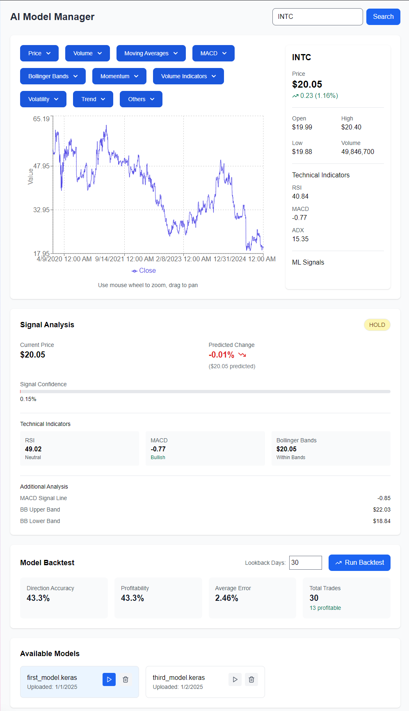
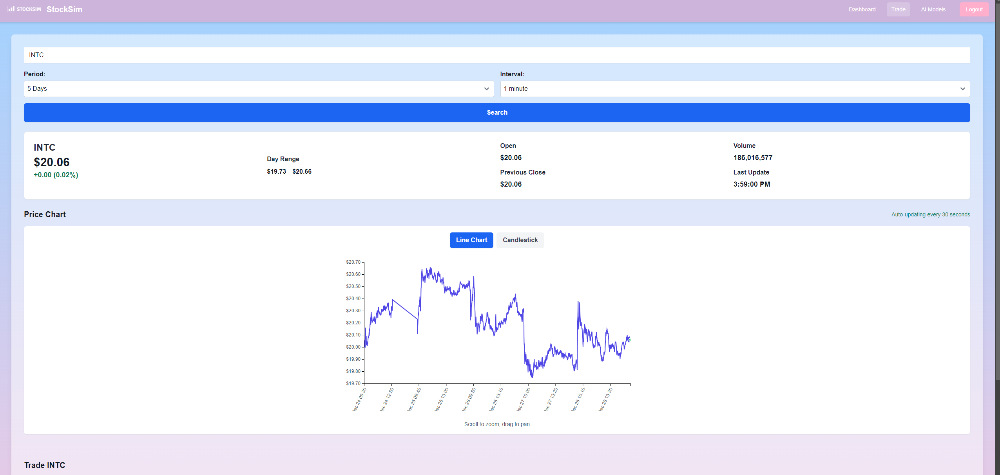
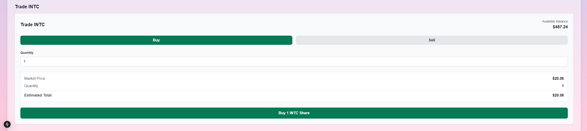
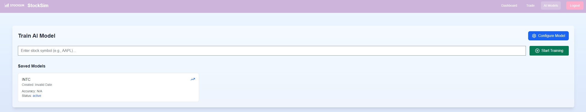
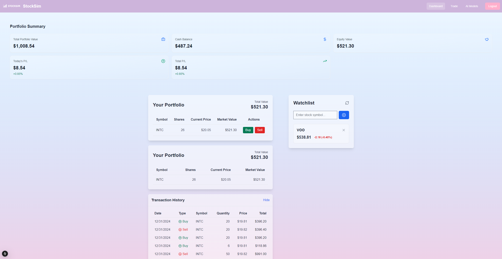
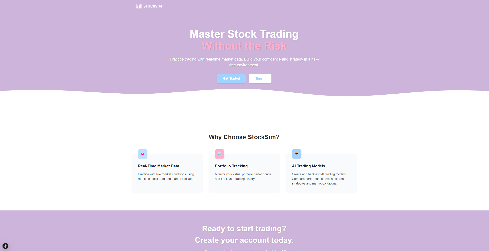

# StockSim: Master Stock Trading Without Risk

## Project Overview
StockSim is a stock trading simulation platform designed to help users practice trading with real-time market data. It provides users with a risk-free environment to build their confidence and strategy in stock trading while leveraging AI-powered tools for analysis and decision-making.

---

## Table of Contents
1. [Features](#features)
2. [Tech Stack](#tech-stack)
3. [Installation and Setup](#installation-and-setup)
4. [Usage Guide](#usage-guide)
5. [Project Structure](#project-structure)
6. [Screenshots](#screenshots)
7. [Contributing](#contributing)
8. [License](#license)

---

## Features
- **Real-Time Market Data**: Fetch live market data to simulate trading conditions.
- **AI Model Manager**: Train and backtest machine learning trading models.
- **Portfolio Management**: Monitor your virtual portfolio's performance and track your trading history.
- **Interactive UI**: User-friendly interface for seamless navigation and functionality.
- **Secure Authentication**: Robust login and registration system for secure user access.

---

## Tech Stack
- **Frontend**:
  - Next.js
  - TypeScript
  - Tailwind CSS
- **Backend**:
  - FastAPI
  - Python
  - MongoDB
- **Machine Learning**:
  - TensorFlow/Keras
  - Scikit-learn

---

## Installation and Setup

### Prerequisites
- Node.js
- Python 3.8+
- MongoDB instance
- Vercel CLI (optional for deployment)

### Steps
1. **Clone the Repository**:
   ```bash
   git clone https://github.com/your-repo/stocksim.git
   cd stocksim
   ```
2. **Install Frontend Dependencies**:
   ```bash
   cd stocksim
   npm install
   ```
3. **Install Backend Dependencies**:
   ```bash
   cd src/backend
   pip install -r requirements.txt
   ```
4. **Set Up Environment Variables**:
   - Create a `.env` file in the `src/backend/app` and `stocksim` directories.
   - Refer to `.env.local` and `.env` for variable definitions.

5. **Run the Backend Server**:
   ```bash
   cd src/backend/app
   python main.py
   ```
6. **Run the Frontend Server**:
   ```bash
   cd stocksim
   npm run dev
   ```
7. **Access the Application**:
   Navigate to `http://localhost:3000` in your web browser.

---

## Usage Guide

### Login and Registration
- Navigate to the login or registration page.
- Enter credentials to create an account or access your existing profile.

### Dashboard
- Monitor your portfolio's performance, view the watchlist, and analyze transaction history.

### Trading
- Search for a stock symbol (e.g., INTC) and execute buy or sell trades.
- View price charts and analyze market trends before making decisions.

### AI Model Manager
- Train and test AI trading models using historical stock data.
- Evaluate model accuracy and performance.

---

## Project Structure
```
|- stocksim
  |- src
    |- app
      |- api
      |- dashboard
      |- login
      |- model-training
      |- register
      |- trade
    |- backend
      |- app
      |- models
      |- utils
    |- components
    |- lib
    |- middleware.ts
    |- types
  |- public
  |- node_modules
  |- package.json
  |- tsconfig.json
  |- tailwind.config.js
```
Refer to [project_structure.txt](project_structure.txt) for a detailed breakdown.

---

## Screenshots

### Login Page


### AI Model Manager


### Trade Interface



### Model Training


### Dashboard


### Landing Page


---

## Contributing
We welcome contributions to improve StockSim. Follow these steps:
1. Fork the repository.
2. Create a new branch for your feature or bug fix.
3. Commit and push your changes.
4. Submit a pull request.

---

## License
StockSim is licensed under the MIT License. See `LICENSE` for more details.

---

